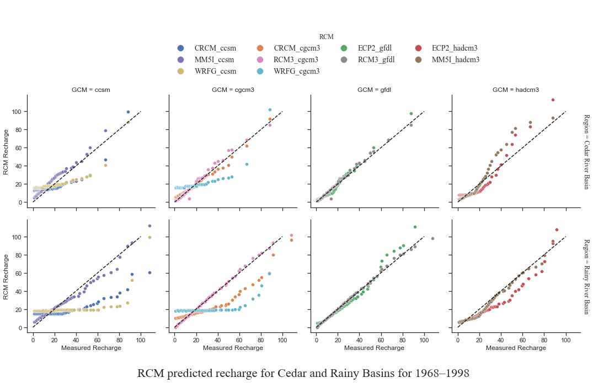

# Better Visualization is for Readers' Understanding: Take a Graph about Groundwater Recharge as an Example

- Date: Dec 3, 2021
- Authors: Haocheng Geng, Yufei Wang, Zhijie Yang 

***Abstract***

*We find the previous chart on the website and search for information about "how weather influences groundwater storage" on the internet. However, its data is too dense to see, so we separate the data into 4 different kinds of the chart, it can not only make the data points clear, but also make the trend vivid. This chart has 10 various models, each model is used in both two situations. The much closer the points in each model to the 1:1 line, the better the model is.*


## 1. Introduction

In the beginning, we selected the information visualization chart of global carbon emissions, restored the visualization picture completely, and improved the chart. However, we changed the image to be more complex, which was not in line with the simple and intuitive characteristics of visual diagrams.  We also had no better improvement scheme, so we gave up the scheme. Then we chose a visualization about groundwater recharge. 

The interaction among atmosphere, hydrosphere, lithosphere, and biosphere is the most critical, active, and an important link in the terrestrial water system. The terrestrial water cycle is affected by climate and environmental changes as well as human activities and determines the formation of water resources and environmental changes related to water and soil. Groundwater recharge plays a vital role in replenishing aquifers, sustaining demand, and reducing adverse effects. To manage climate change-induced effects on groundwater dynamics, climate models are increasingly being used to predict current and future recharges. The graph we selected illustrates RCM predicted recharge for Cedar and Rainy Basins for 1968-1998, and there are 10 different kinds of models in RCM. The data get much closer to the 1:1 line, the model has a much better effect. 


## 2. Detailed explanation

### 2.1 Why selected this visualization


Groundwater recharge plays a vital role in replenishing aquifers, sustaining demand, and reducing adverse effects. Authorities in Lanzhou, the capital of northwestern Gansu province, have a serious problem with groundwater. Zhang Piaomiao, a 36-year-old resident of Lanzhou who works in a consultancy company, said she is still afraid of drinking the tap water despite the go-ahead from authorities." The thought that I might have been drinking polluted water for decades saddens me. It seems to me that the government doesn't have the right attitude and has not taken the right actions to answer questions from residents," she said. 

Even though there have been several hydrological studies that have averaged climate models' predictions in a Bayesian framework, few studies have been related to groundwater recharge. These are the reasons why this picture attracts us to select.

### 2.2 Explanation of graph

There is a [large view](https://iwaponline.com/view-large/figure/2603521/jwc-d-20-00345f02.tif) of the graph named **RCM predicted recharge for (a) Cedar and (b) Rainy Basins for 1968–1998**.

We find the visualization on a [web page](https://iwaponline.com/jwcc/article/doi/10.2166/wcc.2021.345/83950/Estimation-of-groundwater-recharge-using-multiple#supplementary-data) which is an essay, and the graph is the **Figure 2** of the essay.

We also put the picture into the current directory. (named figure2.png) 

For the ten models (CRCM_ccsm, CRCM_cgcm3, ECP2_gfdl, ECP2_hadcm3, MM5I_ccsm, MM5I_hadcm3, RCM3_cgcm3, RCM3_gfdl, WRFG_ccsm, WRFG_cgcm3), the part before "_" of a model name determines the type of RCM, while the part after that is the general circulation model (GCM) the RCM based on.

This table shows the explanations of the Regional Climate Models (RCM): 

| RCM name | Explanation                                                  |
| -------- | ------------------------------------------------------------ |
| CRCM     | Canadian RCM                                                 |
| ECP2     | Scripps Experimental Climate Prediction Center/Regional Spectral Model |
| MM5I     | Fifth-generation Pennsylvania State University/NCAR Mesoscale Model |
| RCM3     | RCM, version 3                                               |
| WRFG     | Weather Research and Forecasting Grell model                 |

This table shows the explanations of the general circulation model (GCM): 

| GCM name | Explanation                                   |
| -------- | --------------------------------------------- |
| ccsm     | Community Climate System Model                |
| cgcm3    | Third Generation Coupled Global Climate Model |
| gfdl     | Geophysical Fluid Dynamics Laboratory model   |
| hadcm3   | Hadley Climate Model                          |

This graph compares different climate models in simulating the groundwater recharge with real measured recharge for both Cedar and Rainy River Basins. Both Cedar and Rainy River Basins' streamflow dataset was obtained from the United States Geological Survey. When trying to reproduce the original figure, we spent a lot of time finding the original dataset but still haven't, so we estimate the original data points and created a new dataset.  

We think the model performs better when the trend is closer to the 1:1 line (Coefficient of Determination value close to 100%). In the Cedar River Basin, RCM3_gfdl is the best performing RCM. In the Rainy River Basin, RCM3_cgcm3 is the best performing RCM. In both basins, CRCM_ccsm is the worst performing model. The poor performance of the CRCM_ccsm model can be attributed to the fact that it uses the CLASS LSM which has been found to overestimate both evapotranspiration and surface runoff and therefore to underestimate aquifer recharge. Most RCMs ( WRFG_ccsm, WRFG_cgcm3, and MM5I_ccsm) underestimated recharge, whereas a few RCMs (e.g. ECP2_hadcm3and RCM3_cgcm3) overestimated recharge in both basins.

### 2.3 Relevant cognitive theory

#### 2.3.1 Advantages of the graph

Use auxiliary lines to help the audience get into the scenario of the chart. The 1:1 red line represents the situation that predicts data is equivalent to the real measure value, which means the model has a low margin of error. It used the auxiliary lines to help the audience to identify which model performs better. It used conspicuous color (red) to draw the audience's attention to what the figure wants to illustrate most. 

It shows a figure with 2 rows and 1 column that the two plots display on top of each other which separate RCM in different Basins to control variates. 

#### 2.3.2 Defects of the graph

The idea of attention as a resource is that the cognitive system has a limited resource that can be used for carrying out so-called attention-demanding processes. When first saw this figure, we thought it was messy and cluttered, making it hard to get accurate information. There are so many types of models in each image that we find it is hard to concentrate all of it because our attention is limited. 

Cognitive tunneling is the mental state in which your brain focuses on one thing and, as a result, does not see other relevant data. This perceptual blindness causes our attention to overlook even the most obvious clues to problems that are right in front of us. When our group members and other volunteers first saw this figure, they all paid attention to trying to identify overlaps and ignore the trend (the most important part). The overlap part clutters the audience’s field of view seriously.

## 3. Duplicate the original graph

We didn't find the dataset of the graph, but we estimated the locations of the points and drew a similar one. We also chose the styles of the points similar to the original graph.

 


## 4. Changes to improve the graph

### 4.1 Initial changes

At first, we wanted to make 2*10 small multiples whose rows were the two regions (Cedar and Rainy River Basin) and whose columns were the ten types of regional climate model (RCM), which was implemented by the function **FacetGrid** in seaborn library. Like this:

However, it seemed too long and too dispersive and we thought that when a reader sees this graph, the time they spent browsing from left to right would make them forget some information. What's more, we also want to show the comparison of some models.

Therefore, we separated the original graph into 2*4 small multiples by 4 different general circulation models (GCM): ccsm, cgcm3, gfdl and hadcm3 so that reader could also see the comparison of different RCMs in every GCM.

### 4.2 Second changes

After we conceived the new changes, we set about looking for how to implement them. We added a new column named GCM into our dataset, where the column listed the GCM (part of RCM name behind the "_") of every RCM. Then our dataset was like this: 

| Region            | RCM        | Measured Recharge | RCM Recharge | GCM   |
| ----------------- | ---------- | ----------------- | ------------ | ----- |
| Cedar River Basin | CRCM_ccsm  | 1.0               | 13.2         | ccsm  |
| ...               | ...        | ...               | ...          | ...   |
| Rainy River Basin | WRFG_cgcm3 | 65.4              | 23.8         | cgcm3 |
| ...               | ...        | ...               | ...          | ...   |

This would be more easily used in seaborn.FacetGrid because the parameter "col" of this function could show these 4 GCM and the parameter "hue" could show different kinds of RCM in every GCM.

```python
# A code snippet of the second change.
with sns.axes_style("white"):
    g = sns.FacetGrid(df, row="Region", col="GCM", margin_titles=True, height=3, hue='RCM')
g.map(plt.scatter, "Measured Recharge", "RCM Recharge", edgecolor="white", lw=.5)
g.add_legend()
```

This was just one step. Readers must be dissatisfied with our second change of the graph. See this:

Why? Because firstly, readers could say, "We don't know what the graph mainly shows. You didn't even want to write a title." That was bad. In addition, it was troublesome for readers to look for what a color of points they saw in the graph stood for from the legend because the order of the items in the legend was not like that in the graph.

### 4.3 Final changes

For these problems, we would adjust the locations of the graph, title and legends. Besides, in the original graph, there was a 1:1 line that can show the degree of agreement between the estimated value using models and the actual measured value and we also show it in our new graph. 



This is the latest version of our graph. We also want to add R-Squared (R² or the coefficient of determination) about each RCM, but we are not sure whether it causes the graph to cause a mess. We can see that the black dotted line which is actually the 1:1 line in every small plot. The columns in the figure correspond to the columns in the legend, which makes the readers more convenient to find the corresponding legend. We also increased the size of the points in the legend so that readers can see them clearly. "It seems good now," some readers said like that. 

## 5. Conclusion

+ **Take-home messages**

It is not easy work to improve visualization. For 2 weeks, we looked for a suitable visualization, collected the relevant information, implemented the original graph and changed the graph trying a lot of methods. Implementing a good visualization not only needs our new ideas and hard work, but also requires readers who are not familiar with the requirements of our project to understand what the graph is doing. The latter is more important.

+ **What can be done for better visualization**

The static graph is no longer enough for our needs. We find that Pyechart provides options to beautify labels and ripple effects. With label options, you can define the position, font, size, weight, color, alignment. With effect options, you can change the brush type, color, symbol, symbol size etc to get the animation effect you would expect. We hope our audiences can choose to observe the line they are interested in by itself by clicking the relevant button, which can reach more concise and clear results. 
